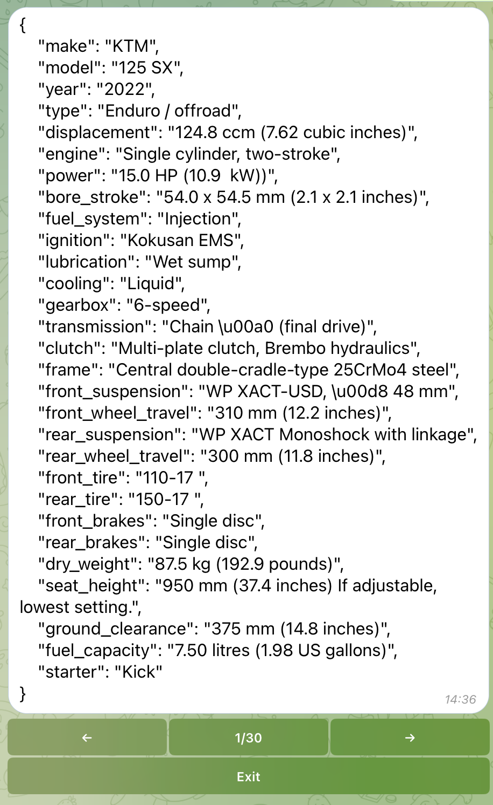

Telegram Bot: @moto_techdata_bot

This bot extracts a motocycle technical data from a third party library at 
www.rapidapi.com by a user request.
Source: https://rapidapi.com/apininjas/api/motorcycles-by-api-ninjas

Result preview:

To run the code:
1. create a file ".env" in root folder
2. fill ".env" with data. Refer to ".env.template" file in root folder.

    
    --> BOT_TOKEN = "Your token for bot issued by @BotFather"
     - Go to @BotFather
     - Send Command /token
     - Send @moto_techdata_bot 
     - Copy bot token and paste it into BOT_TOKEN variable in ".env"
   
    
     --> RAPID_API_KEY = "adae39ec6amsh2a93eae09a7f15dp146c0ajsn2018037eba54"
        "Your key issued by API from
        https://rapidapi.com/apininjas/api/motorcycles-by-api-ninjas"
     - Log in to https://rapidapi.com
     - Open https://rapidapi.com/apininjas/api/motorcycles-by-api-ninjas
     - Go to Code Snippets section (right bottom corner)
     - Choose Python/Requests
     - Copy value of "X-RapidAPI-Key" and paste into RAPID_API_KEY variable
     - in ".env"

3. Run "main.py" in root folder.

        Bot's dependencies are as follows (refer to "bot_requirements.txt"):
            black==24.2.0
            certifi==2024.2.2
            charset-normalizer==3.3.2
            click==8.1.7
            idna==3.6
            loguru==0.7.2
            mypy-extensions==1.0.0
            packaging==23.2
            pathspec==0.12.1
            peewee==3.17.1
            platformdirs==4.2.0
            pyTelegramBotAPI==4.16.1
            python-dotenv==1.0.1
            requests==2.31.0
            tomli==2.0.1
            typing_extensions==4.10.0rc1
            urllib3==2.2.1        
